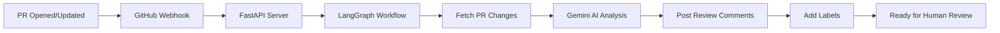

# GitHub PR Code Review Agent 🤖

An intelligent AI-powered code review agent that automatically reviews Pull Requests using Google Gemini AI and posts detailed inline comments directly on GitHub.

## Features ✨

- 🔍 **Automated Code Analysis** - Reviews code changes using Google Gemini AI
- 💬 **Inline Comments** - Posts detailed review comments on specific lines
- 🏷️ **Smart Labeling** - Automatically adds labels based on review status
- 🔐 **Secure Authentication** - Uses GitHub App authentication
- 📊 **Severity Classification** - Categorizes issues by severity (High/Medium/Low)
- 🎯 **Multiple Categories** - Identifies bugs, security issues, performance problems, style issues, and best practices
- 🚀 **Human-Controlled Approval** - Agent reviews but humans approve and merge

## Prerequisites

Before setting up the agent, ensure you have:

- Python 3.10 or higher
- A GitHub account with admin access to your repository
- A Google account (for Gemini API access)
- ngrok account (free tier is sufficient)

---

## Setup Instructions

### Step 1: Clone the Repository

```bash
git clone <your-repo-url>
cd github-pr-review-agent
```

### Step 2: Create Virtual Environment

```bash
python3 -m venv venv
source venv/bin/activate  # On Windows: venv\Scripts\activate
```

### Step 3: Install Dependencies

```bash
pip install -r requirements.txt
```

### Step 4: Create GitHub App

1. **Navigate to GitHub App Settings:**
   - Go to: https://github.com/settings/apps
   - Click **"New GitHub App"**

2. **Configure Basic Information:**
   - **GitHub App name:** `PR-Review-Agent-[YourOrgName]` (must be globally unique)
   - **Homepage URL:** `http://localhost:8000`
   - **Webhook URL:** `http://localhost:8000/webhook/github` (temporary, will update later)
   
3. **Generate Webhook Secret:**
   ```bash
   python3 -c "import secrets; print(secrets.token_hex(32))"
   ```
   Copy the output and paste it in the **Webhook secret** field

4. **Set Repository Permissions:**
   - **Pull requests:** Read & write ✅
   - **Contents:** Read only ✅
   - **Metadata:** Read only ✅ (automatic)

5. **Subscribe to Events:**
   - Check ✅ **Pull request**

6. **Installation Settings:**
   - Select **"Only on this account"**

7. **Create the App:**
   - Click **"Create GitHub App"**
   - **Save the App ID** (shown at the top of the page)

8. **Generate Private Key:**
   - Scroll to **"Private keys"** section
   - Click **"Generate a private key"**
   - A `.pem` file will download
   - Move it to the project directory:
     ```bash
     mv ~/Downloads/your-app-name*.private-key.pem ./
     ```

9. **Install the App:**
   - Click **"Install App"** in the left sidebar
   - Click **"Install"** next to your organization/account
   - Select repositories (choose "All repositories" or specific ones)
   - Click **"Install"**

### Step 5: Get Google Gemini API Key

1. **Visit Google AI Studio:**
   - Go to: https://aistudio.google.com/app/apikey
   - Sign in with your Google account

2. **Create API Key:**
   - Click **"Create API Key"**
   - Select **"Create API key in new project"** (or use existing)
   - Copy the API key (starts with `AIza...`)
   - **Save it securely** - you won't see it again!

> **Note:** The free tier includes 15 requests/minute and 1 million tokens/minute - sufficient for most teams.

### Step 6: Configure Environment Variables

1. **Copy the example file:**
   ```bash
   cp .env.example .env
   ```

2. **Edit `.env` with your credentials:**
   ```bash
   # GitHub App Configuration
   GITHUB_APP_ID=your_app_id_here
   GITHUB_PRIVATE_KEY_PATH=./your-app-name.private-key.pem
   GITHUB_WEBHOOK_SECRET=your_webhook_secret_here
   
   # Google Gemini Configuration
   GOOGLE_API_KEY=your_gemini_api_key_here
   GEMINI_MODEL=gemini-2.5-flash
   
   # Server Configuration
   SERVER_HOST=0.0.0.0
   SERVER_PORT=8000
   
   # Review Configuration (optional)
   MIN_REVIEW_SEVERITY=low
   AUTO_LABEL_ON_COMPLETE=true
   READY_FOR_APPROVAL_LABEL=ready-for-approval
   AI_REVIEW_COMPLETE_LABEL=ai-review-complete
   ```

### Step 7: Set Up ngrok

1. **Sign up for ngrok:**
   - Go to: https://dashboard.ngrok.com/signup
   - Sign up with Google/GitHub (free)

2. **Get your authtoken:**
   - Visit: https://dashboard.ngrok.com/get-started/your-authtoken
   - Copy your authtoken

3. **Configure ngrok:**
   ```bash
   ngrok config add-authtoken YOUR_AUTHTOKEN_HERE
   ```

### Step 8: Start the Application

1. **Start the server:**
   ```bash
   python -m src.main
   ```
   
   You should see:
   ```
   INFO: Uvicorn running on http://0.0.0.0:8000
   ```

2. **In a new terminal, start ngrok:**
   ```bash
   ngrok http 8000
   ```
   
   You'll see output like:
   ```
   Forwarding  https://abc123xyz.ngrok.io -> http://localhost:8000
   ```
   
   **Copy the `https://` URL**

### Step 9: Update GitHub Webhook URL

1. Go back to: https://github.com/settings/apps
2. Click on your app name
3. Update **Webhook URL** to: `https://your-ngrok-url.ngrok.io/webhook/github`
4. Click **"Save changes"**

### Step 10: Test the Agent

1. **Create a test branch:**
   ```bash
   cd /path/to/your/test/repository
   git checkout -b test-ai-review
   ```

2. **Make some code changes and commit:**
   ```bash
   # Edit some files
   git add .
   git commit -m "Test AI code review"
   git push origin test-ai-review
   ```

3. **Open a Pull Request on GitHub**

4. **Wait 10-30 seconds** - the agent will:
   - Analyze your code
   - Post inline review comments
   - Add labels to the PR

---

## Configuration Options

### Review Severity Levels

Set `MIN_REVIEW_SEVERITY` in `.env` to filter comments:
- `low` - Show all comments (default)
- `medium` - Show only medium and high severity
- `high` - Show only critical issues

### Custom Labels

Customize the labels added to PRs:
- `AI_REVIEW_COMPLETE_LABEL` - Added when review finishes
- `READY_FOR_APPROVAL_LABEL` - Added when no high-severity issues found

### Gemini Model

You can change the AI model in `.env`:
- `gemini-2.5-flash` - Fast, good for most cases (default)
- `gemini-1.5-pro` - More thorough but slower

---

## How It Works



1. **Webhook Trigger** - GitHub sends webhook when PR is opened/updated
2. **Fetch Changes** - Agent retrieves the code diff
3. **AI Analysis** - Gemini analyzes code for issues
4. **Post Comments** - Inline comments posted on specific lines
5. **Add Labels** - Status labels added automatically
6. **Human Review** - Team reviews and approves/merges

---

## Deployment

### Production Deployment Options

#### Option 1: Railway (Recommended)

1. Create account at https://railway.app
2. Connect your GitHub repository
3. Add environment variables from `.env`
4. Deploy - Railway provides a permanent URL
5. Update GitHub webhook URL to Railway URL

#### Option 2: Render

1. Create account at https://render.com
2. Create new Web Service
3. Connect repository
4. Add environment variables
5. Deploy and update webhook URL

#### Option 3: Docker

```bash
# Build image
docker build -t pr-review-agent .

# Run container
docker run -p 8000:8000 --env-file .env pr-review-agent
```

---

## Troubleshooting

### Issue: Webhook not received

**Check:**
- ngrok is running
- Webhook URL in GitHub matches ngrok URL
- Server is running on port 8000

**Solution:**
```bash
# Verify server is running
curl http://localhost:8000/health

# Check ngrok URL
curl https://your-ngrok-url.ngrok.io/health
```

### Issue: No comments posted

**Check:**
- GitHub App has correct permissions (Pull requests: Read & Write)
- App is installed on the repository
- Gemini API key is valid

**Debug:**
Check server logs for errors

### Issue: "Quota exceeded" error

**Solution:**
- Wait a few minutes for quota to reset
- Free tier: 15 requests/minute
- Consider upgrading Gemini API plan for higher limits

---

## Team Usage

### For Developers

1. **Create a branch** and make your changes
2. **Open a Pull Request**
3. **Wait for AI review** (10-30 seconds)
4. **Address comments** - fix issues or discuss with team
5. **Request human review** once AI review is addressed
6. **Merge** after human approval

### For Reviewers

1. **Check AI comments** first
2. **Verify fixes** for flagged issues
3. **Add your own review** for architecture/design
4. **Approve and merge** when satisfied

---

## Security Notes

- ⚠️ **Never commit `.env` file** - contains sensitive credentials
- ⚠️ **Keep `.pem` file secure** - GitHub App private key
- ⚠️ **Rotate secrets regularly** - webhook secret and API keys
- ✅ **Use GitHub App** - more secure than Personal Access Tokens

---

## Contributing

1. Fork the repository
2. Create a feature branch
3. Make your changes
4. Test thoroughly
5. Submit a Pull Request

---

## License

MIT License - see LICENSE file for details

---

## Support

For issues or questions:
- Check the troubleshooting section above
- Review server logs for detailed error messages
- Open an issue on GitHub

---

## Architecture

For detailed architecture documentation, see [docs/architecture.md](docs/architecture.md)

---

**Built with:**
- 🤖 [LangGraph](https://github.com/langchain-ai/langgraph) - Workflow orchestration
- 🧠 [Google Gemini](https://ai.google.dev/) - AI code analysis
- 🐙 [PyGithub](https://github.com/PyGithub/PyGithub) - GitHub API integration
- ⚡ [FastAPI](https://fastapi.tiangolo.com/) - Webhook server
