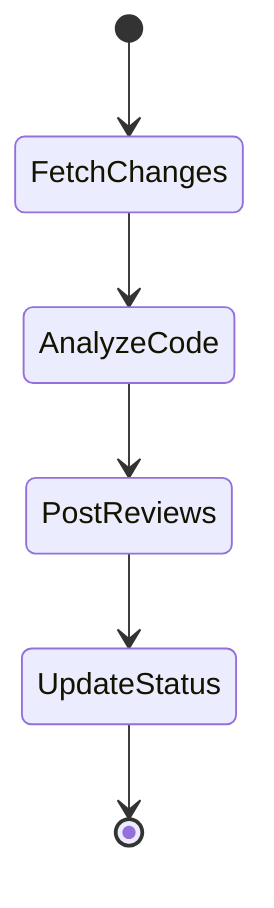
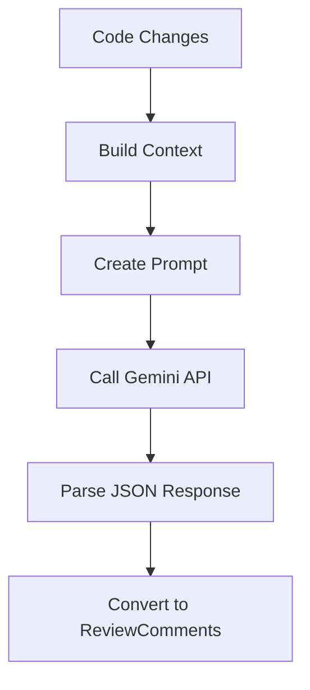

# Architecture Overview

## System Architecture

The GitHub PR Review Agent uses a **LangGraph-based workflow** to orchestrate the code review process. The system is event-driven, triggered by GitHub webhooks when pull requests are opened or updated.

## High-Level Flow

```mermaid
graph LR
    A[GitHub PR Event] --> B[Webhook Handler]
    B --> C[Verify Signature]
    C --> D[Extract PR Metadata]
    D --> E[Start LangGraph Workflow]
    E --> F[Fetch PR Changes]
    F --> G[AI Code Analysis]
    G --> H[Post Review Comments]
    H --> I[Update PR Status]
    I --> J[Add Labels]
```



## Components

### 1. Webhook Handler (`src/github/webhook_handler.py`)

**Responsibilities:**
- Receive GitHub webhook events via FastAPI
- Verify webhook signatures for security
- Extract PR metadata from payload
- Trigger workflow execution in background

**Key Features:**
- HMAC-SHA256 signature verification
- Async background task processing
- Event filtering (only process PR open/reopen/sync events)

### 2. LangGraph Workflow (`src/workflow/review_graph.py`)

**State Machine Nodes:**



**Node Descriptions:**

- **fetch_pr_changes**: Retrieves diff and file changes from GitHub API
- **analyze_code**: Sends code to Gemini for AI analysis
- **post_reviews**: Posts inline comments on GitHub PR
- **update_status**: Adds labels and summary comment

**State Schema:**
```python
ReviewState = {
    "pr_metadata": PRMetadata,      # Repo, PR number, author, etc.
    "changes": List[CodeChange],     # File diffs
    "review_comments": List[ReviewComment],  # AI-generated comments
    "analysis_complete": bool,
    "comments_posted": bool,
    "ready_for_approval": bool,
    "error": Optional[str]
}
```

### 3. GitHub Client (`src/github/client.py`)

**Authentication:**
- Uses GitHub App with JWT-based authentication
- Generates installation access tokens
- Caches tokens per installation

**API Operations:**
- `get_pr_diff()` - Fetch file changes
- `post_review_comment()` - Post inline comments
- `post_pr_comment()` - Post general comments
- `add_label()` - Add/create labels

### 4. Code Reviewer (`src/agents/code_reviewer.py`)

**AI Analysis Pipeline:**



**Prompt Engineering:**
- System prompt defines review categories and severity levels
- User prompt includes formatted diffs with file context
- Structured JSON output for reliable parsing

**Review Categories:**
- Bugs (logic errors, crashes, edge cases)
- Security (vulnerabilities, unsafe operations)
- Performance (inefficiencies, optimizations)
- Style (formatting, naming, readability)
- Best Practices (design patterns, maintainability)

## Data Flow

### 1. PR Opened Event

```
GitHub → Webhook → FastAPI Handler
                        ↓
                  Verify Signature
                        ↓
                  Extract Metadata
                        ↓
                  Background Task
```

### 2. Workflow Execution

```
Initial State → fetch_pr_changes → analyze_code → post_reviews → update_status
     ↓                ↓                  ↓              ↓              ↓
  Empty State    Load Diffs      AI Analysis    Post Comments   Add Labels
```

### 3. GitHub API Interactions

```
Workflow Node → GitHub Client → GitHub App Auth → API Request → GitHub
```

## Security

### Webhook Signature Verification

```python
HMAC-SHA256(webhook_secret, request_body) == X-Hub-Signature-256
```

### GitHub App Authentication

```python
JWT(app_id, private_key) → Installation Token → API Access
```

## Error Handling

**Strategy:**
- Errors captured in state (`error` field)
- Workflow continues but skips dependent nodes
- Errors logged with structured logging
- Failed comments logged but don't stop workflow

**Error Types:**
- GitHub API errors (rate limits, permissions)
- Gemini API errors (quota, parsing)
- Network errors (timeouts, connectivity)

## Scalability Considerations

**Current Design:**
- Single-instance deployment
- Background task processing
- In-memory state (no persistence)

**Future Enhancements:**
- Redis for state persistence
- Message queue (Celery, RabbitMQ) for distributed processing
- Database for review history
- Caching for repeated analyses

## Configuration

**Environment-based:**
- GitHub App credentials
- Gemini API key
- Review thresholds
- Label customization

**Runtime:**
- Severity filtering
- Auto-labeling toggle
- Custom prompts (future)

## Monitoring

**Structured Logging:**
- JSON-formatted logs
- Request/response tracking
- Error tracking with context
- Performance metrics (timing)

**Key Metrics:**
- Webhook processing time
- AI analysis duration
- Comment posting success rate
- Error rates by type

## Deployment Architecture

### Local Development
```
Developer Machine
├── FastAPI Server (port 8000)
├── ngrok Tunnel (public URL)
└── GitHub Webhooks → ngrok → FastAPI
```

### Production (Example)
```
GitHub → Cloud Load Balancer → Container (FastAPI)
                                    ↓
                              LangGraph Workflow
                                    ↓
                         GitHub API ← → Gemini API
```

## Technology Stack

- **Framework**: FastAPI (async web server)
- **Orchestration**: LangGraph (workflow state machine)
- **AI**: Google Gemini 1.5 Flash (code analysis)
- **GitHub**: PyGithub + GitHub App (authentication)
- **Config**: Pydantic Settings (type-safe configuration)
- **Logging**: structlog (structured logging)

## Future Enhancements

1. **Persistent Storage** - Track review history
2. **Learning System** - Improve based on accepted/rejected suggestions
3. **Custom Rules** - Repository-specific review criteria
4. **Multi-LLM Support** - Fallback to other models
5. **Incremental Reviews** - Only review changed lines in updates
6. **Team Integration** - Slack/Discord notifications
7. **Analytics Dashboard** - Review metrics and insights
